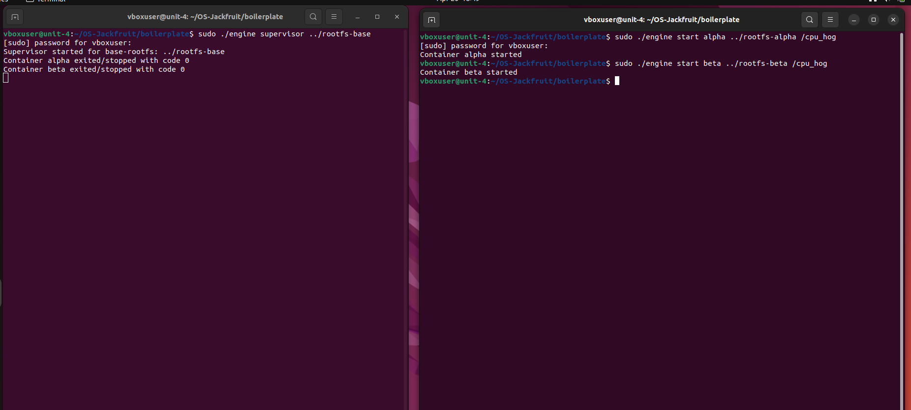
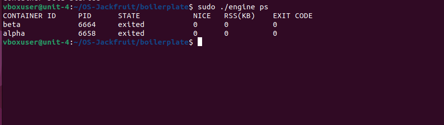
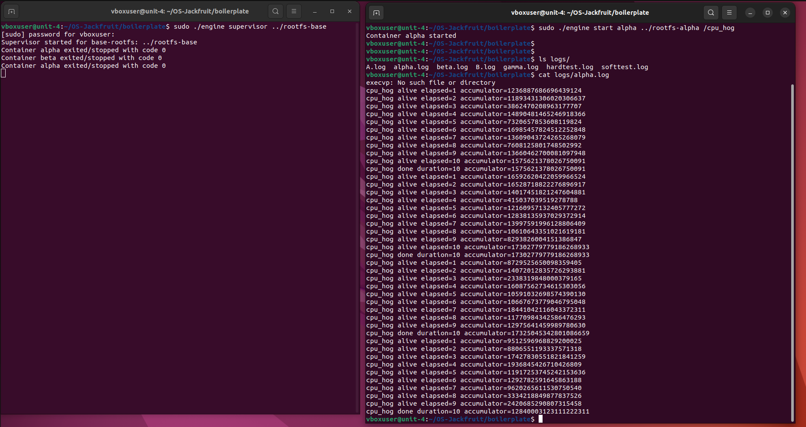
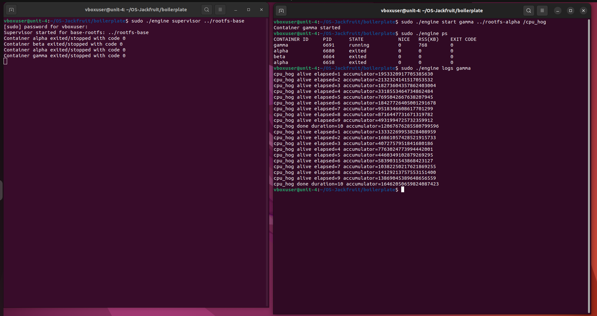
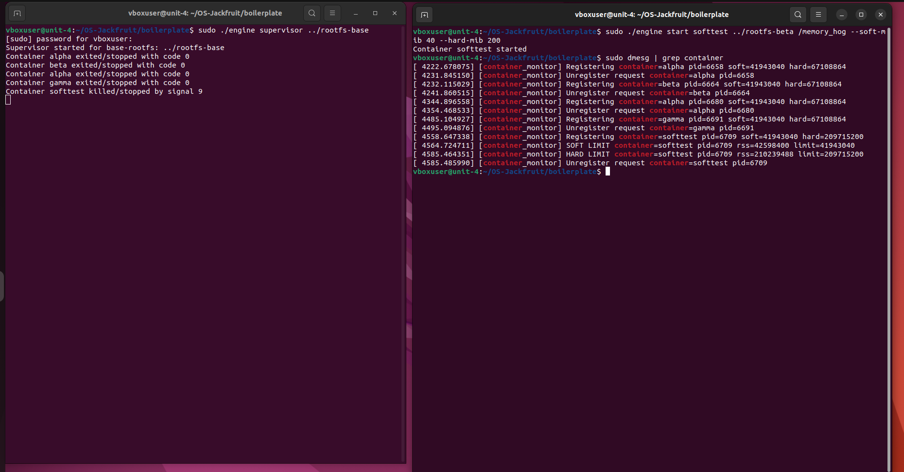
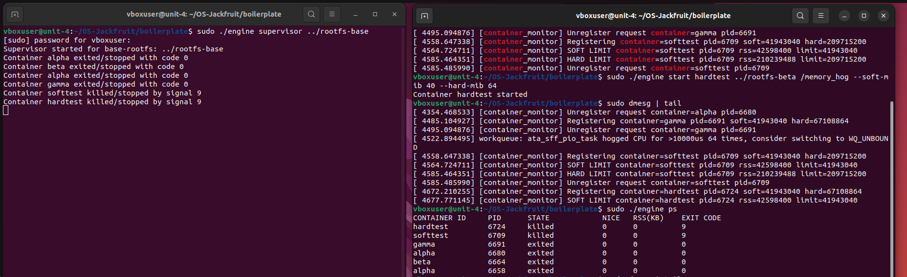
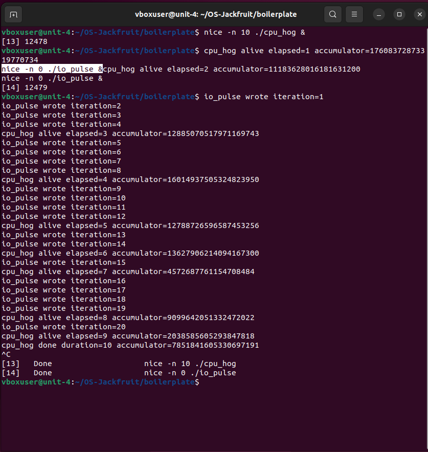
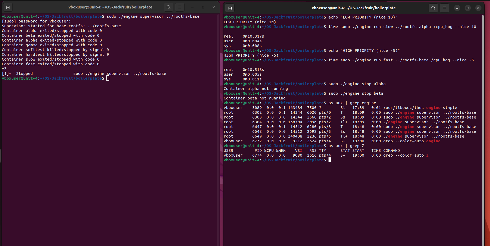
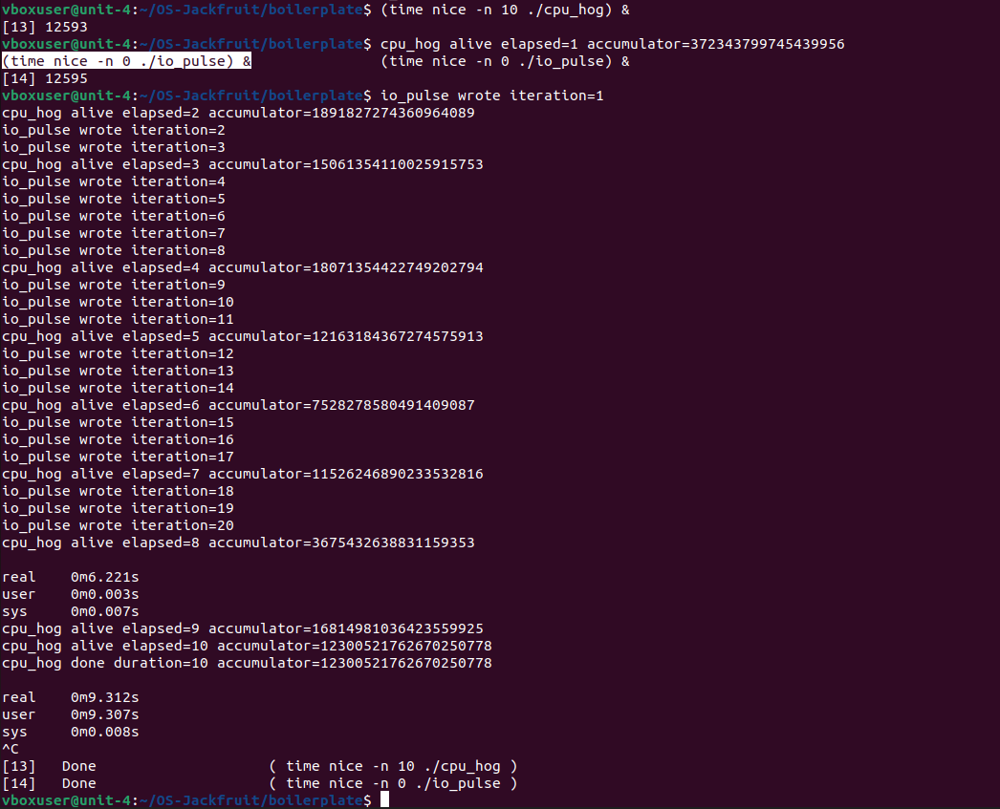

# Multi-Container Runtime (OS Project)

---

##TEAM
1. Annanya Sharma (PES1UG24CS069)
2. Ayushi Srivastava (PES1UG24CS105)

## 1. Build, Load, and Run Instructions

> These steps assume a fresh Ubuntu 22.04/24.04 VM with Secure Boot disabled.

### Step 1: Build the Project

```bash
cd boilerplate
make
```

### Step 2: Load Kernel Module

```bash
sudo insmod monitor.ko
```

Verify:

```bash
lsmod | grep monitor
ls -l /dev/container_monitor
```

### Step 3: Prepare Root Filesystems

```bash
cd ..
mkdir rootfs-base

# Download and extract Alpine rootfs
wget https://dl-cdn.alpinelinux.org/alpine/v3.20/releases/x86_64/alpine-minirootfs-3.20.3-x86_64.tar.gz
tar -xzf alpine-minirootfs-3.20.3-x86_64.tar.gz -C rootfs-base

# Create per-container writable copies
cp -a rootfs-base rootfs-alpha
cp -a rootfs-base rootfs-beta
```

### Step 4: Copy Workloads into Containers

```bash
cp boilerplate/cpu_hog rootfs-alpha/
cp boilerplate/memory_hog rootfs-beta/
chmod +x rootfs-alpha/cpu_hog
chmod +x rootfs-beta/memory_hog
```

### Step 5: Start Supervisor

```bash
cd boilerplate
sudo ./engine supervisor ../rootfs-base
```

> This process remains running and manages all containers.

### Step 6: Launch Containers *(in another terminal)*

```bash
sudo ./engine start alpha ../rootfs-alpha /cpu_hog
sudo ./engine start beta ../rootfs-beta /memory_hog --soft-mib 40 --hard-mib 64
```

### Step 7: Inspect Containers

```bash
sudo ./engine ps
```

### Step 8: View Logs

```bash
sudo ./engine logs alpha
cat logs/alpha.log
```

### Step 9: Kernel Monitoring

```bash
dmesg | grep container
```

Shows:
- Container registration
- Soft limit warnings
- Hard limit kills

### Step 10: Stop Containers

```bash
sudo ./engine stop alpha
sudo ./engine stop beta
```

### Step 11: Stop Supervisor

Press `Ctrl + C`

Expected output:
```
Supervisor shutting down. Stopping all containers...
```

### Step 12: Cleanup

```bash
sudo rmmod monitor
make clean
```

---

## 2. Screenshots

1. Multi-container supervision 

2. Metadata tracking

3. Bounded-buffer logging

4. CLI and IPC

5. Soft-limit warning

6. Hard-limit enforcement

7. Scheduling experiment

8. Clean teardown


---

## 3. Engineering Analysis

### 3.1 Isolation Mechanisms

Our runtime achieves process isolation using Linux namespaces created via `clone()` with the flags `CLONE_NEWPID`, `CLONE_NEWUTS`, and `CLONE_NEWNS`.

The **PID namespace** provides each container with its own process ID space, where the container's init process sees itself as PID 1, while the host maintains the real process IDs. The **UTS namespace** isolates the hostname, allowing each container to have its own system identity. The **mount namespace** gives each container a private mount table, preventing it from seeing or modifying the host's filesystem mounts.

Filesystem isolation is further enforced using `chroot`, which changes the root directory of the container to its assigned rootfs, ensuring the container cannot access files outside its designated filesystem.

Despite these isolations, all containers still share the same underlying host kernel — including the system call interface, CPU scheduler, memory management subsystem, and physical hardware resources. Additionally, since network and user namespaces are not implemented, containers share the host's network stack and user ID mappings.

---

### 3.2 Supervisor and Process Lifecycle

A long-running supervisor process is essential for managing container lifecycles. It serves as the parent of all container processes, maintaining the parent-child relationship necessary for correct process management.

When containers are created using `clone()`, the supervisor retains control and receives `SIGCHLD` signals upon child termination. It uses `waitpid()` in a non-blocking manner to reap exited children, preventing zombie processes.

The supervisor maintains metadata for each container, including its PID, state, start time, and exit status. To distinguish termination types, the supervisor uses a `stop_requested` flag:

| Exit Type | Condition |
|-----------|-----------|
| `EXITED` | Container exits normally |
| `STOPPED` | Explicitly stopped via CLI |
| `KILLED` | Terminated by a signal (e.g., memory limit enforcement) |

---

### 3.3 IPC, Threads, and Synchronization

The system uses two distinct IPC mechanisms:

**Path A — Logging Pipeline:**
Each container's stdout and stderr are redirected to a pipe. Producer threads read from these pipes and insert log data into a bounded buffer. A consumer thread removes entries from the buffer and writes them to per-container log files.

The bounded buffer is implemented as a circular queue protected by a mutex and coordinated using two condition variables (`not_empty` and `not_full`). Producers block when the buffer is full, and consumers block when it is empty.

**Path B — Control Channel:**
A UNIX domain socket is used for communication between CLI clients and the supervisor. Clients send structured requests, and the supervisor processes them and sends responses back. For shared metadata (container list), a mutex ensures safe concurrent access.

**Race Conditions Without Synchronization:**
Without proper synchronization, multiple producer threads could overwrite shared buffer slots simultaneously, leading to corrupted log data. Consumers could read partially written data or inconsistent states.

**Why These Primitives Were Chosen:**
Mutexes and condition variables provide efficient blocking synchronization. Unlike spinlocks, they avoid wasting CPU cycles while waiting. The kernel module also uses a mutex to protect the monitored process list — since updates are infrequent and timer-based, this is preferred over a spinlock to avoid unnecessary CPU usage.

---

### 3.4 Memory Management and Enforcement

**Resident Set Size (RSS)** represents the number of memory pages currently held in physical RAM by a process. It does not include swapped-out pages, non-resident memory mappings, or reclaimable cache pages.

The system enforces two types of memory limits:

| Limit Type | Behavior |
|------------|----------|
| **Soft limit** | Warning threshold — generates a log message once when exceeded |
| **Hard limit** | Enforcement threshold — terminates the process when exceeded |

These two levels allow early detection of abnormal memory growth while still enforcing strict limits when necessary.

Memory enforcement is implemented in kernel space because only the kernel has direct and accurate access to process memory information (`mm_struct`). User-space solutions cannot reliably track real memory usage or enforce limits without race conditions, especially under rapid allocation scenarios.

---

### 3.5 Scheduling Behaviour

To evaluate Linux scheduling behavior, we ran two workloads concurrently with different nice values:

- `cpu_hog` (CPU-bound) with `nice = 10` (lower priority)
- `io_pulse` (I/O-bound) with `nice = 0` (higher priority)

**Observed Behavior:**
During execution, `io_pulse` progressed quickly and completed all iterations in a short amount of time, producing continuous output. In contrast, `cpu_hog` continued running in the background and completed more slowly, printing periodic progress updates over a longer duration.

**Explanation:**
This behavior reflects the design of the Linux Completely Fair Scheduler (CFS):

- **Responsiveness:** The I/O-bound process (`io_pulse`) frequently sleeps while waiting for I/O. Because it does not continuously consume CPU time, its virtual runtime (`vruntime`) increases slowly. When it wakes up, the scheduler prioritizes it so it can run immediately.
- **Fairness:** The CPU-bound process (`cpu_hog`) continuously uses CPU resources, causing its `vruntime` to grow quickly. Its higher nice value (10) further lowers its priority compared to `io_pulse` (nice 0), reinforcing this effect.
- **Throughput:** While `cpu_hog` does not complete as quickly in wall-clock time, it still makes steady progress in the background — CFS does not starve CPU-bound processes.

**Conclusion:** Linux scheduling favors responsiveness for I/O-bound tasks while maintaining fair CPU distribution across processes. Nice values influence CPU allocation, but process behavior (CPU-bound vs I/O-bound) plays a critical role in determining how quickly tasks complete.

---

## 4. Design Decisions and Tradeoffs

### Namespace Isolation

**Used:**
- `CLONE_NEWPID`
- `CLONE_NEWUTS`
- `CLONE_NEWNS`
- `chroot`

**Tradeoff:** Network, user, and IPC namespaces were not implemented, so containers share the host network and user identity space.

**Justification:** This simplifies implementation while still demonstrating core isolation concepts required for the project.

---

### Supervisor Architecture

A long-running supervisor process manages all containers.

**Tradeoff:** This introduces additional complexity compared to launching standalone processes.

**Justification:** It enables centralized lifecycle management, proper child reaping, metadata tracking, and shared logging infrastructure.

---

### IPC and Logging

- UNIX domain sockets for control-plane communication
- Pipes + bounded buffer for logging

**Tradeoff:** UNIX sockets require crossing the user-kernel boundary, adding slight overhead.

**Justification:** Control operations are infrequent, and sockets provide a clean and reliable communication mechanism. The bounded buffer ensures no log loss and prevents blocking issues.

---

### Kernel Monitor

A kernel module tracks container memory usage using a linked list for tracking processes, timer-based polling, and mutex synchronization.

**Tradeoff:** Mutexes may introduce blocking and context switches.

**Justification:** The monitoring frequency is low (once per second), and mutexes avoid CPU waste compared to spinlocks, making them more efficient in this context.

---

## 5. Scheduler Experiment Results

To evaluate Linux scheduling behavior, we conducted a concurrent experiment using two workloads with different priorities:

- `cpu_hog` (CPU-bound) with `nice = 10` (lower priority)
- `io_pulse` (I/O-bound) with `nice = 0` (higher priority)

  

### Results

| Workload | Type | Nice Value | Real Time | CPU Usage (user) | Behavior |
|----------|------|------------|-----------|------------------|----------|
| `cpu_hog` | CPU-bound | 10 | ~9.3 sec | ~9.3 sec | Continuous CPU usage, slower completion |
| `io_pulse` | I/O-bound | 0 | ~6.2 sec | ~0.003 sec | Fast bursts, completes quickly |

### Observations

- `io_pulse` completed all 20 iterations significantly faster (~6.2s).
- `cpu_hog` took longer (~9.3s) and continuously consumed CPU.
- CPU usage differs drastically:
  - `cpu_hog` spent almost all time on CPU (user ≈ real)
  - `io_pulse` spent very little CPU time (mostly waiting/sleeping)

### Analysis

This experiment demonstrates key properties of the Linux Completely Fair Scheduler (CFS):

- **Responsiveness:** `io_pulse` is highly responsive and completes faster because it frequently sleeps. While sleeping, it does not accumulate `vruntime`. When it wakes up, the scheduler prioritizes it for immediate execution.
- **Fairness:** `cpu_hog` continuously consumes CPU, causing its `vruntime` to increase rapidly. Combined with its lower priority (`nice = 10`), it receives a smaller share of CPU time relative to `io_pulse`.
- **Throughput:** Despite lower priority, `cpu_hog` is not starved. It continues to make steady progress and completes successfully, demonstrating that CFS balances CPU allocation without completely blocking lower-priority tasks.

### Conclusion

The results show that Linux scheduling favors I/O-bound and higher-priority processes for faster completion and better responsiveness, while still ensuring fair CPU distribution. The combination of nice values and workload behavior (CPU-bound vs I/O-bound) determines how processes are scheduled and how quickly they complete.
